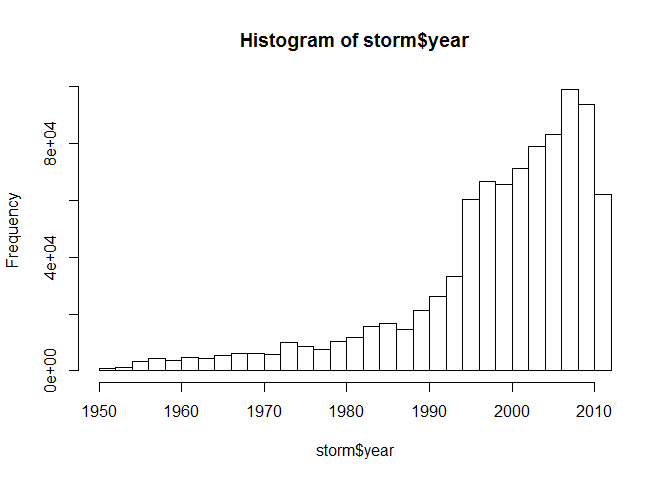
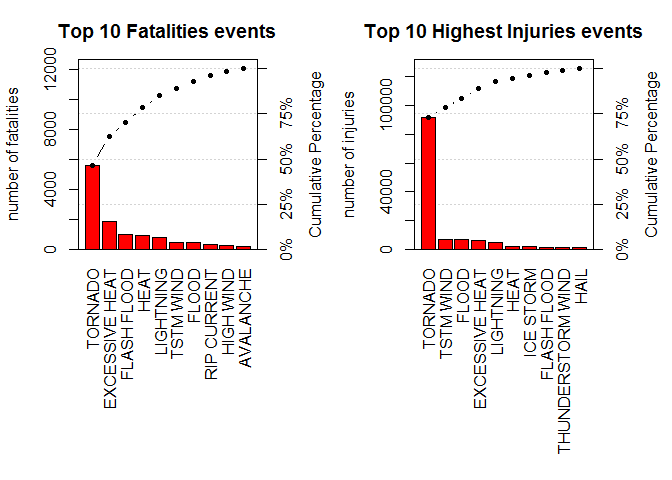
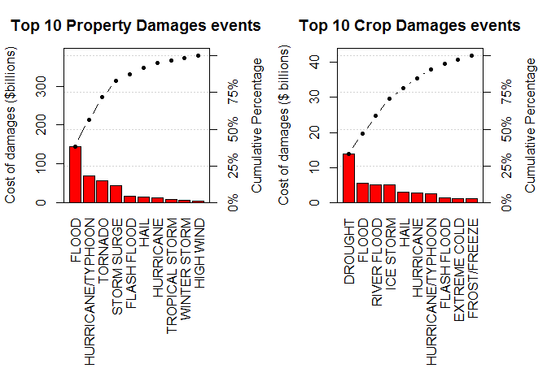

# NOAA Storm Events Data Analysis

## Reproducible Research: Peer Assessment 2

An Analysis Report of Health and Economic Impact by Severe Weather Events - Based on NOAA Storm Database

## Synopsis

Storm and other severe weather events can cause both public health and economic problems for communities and municipalities. Many severe events can results in fatalities, injuries and property damage. Preventing such outcomes to the extent possible is a key concern. 

The U.S. National Oceanic and Atmospheric Administration's (NOAA) storm database tracks characteristics of major storms and weather events in the United States, include when and where they occur, as well as estimates of any fatalities, injuries and property damage. 

This report contains the exploratory analysis results on the health and economic impact by the severe weather events based on the data from NOAA database.

## Data Processing

### Loading the data

```r
setwd("C:/Users/kannanthegreat/Documents/coursera")
```


```r
# download file from URL
if (!file.exists("c:/Users/kannanthegreat/Documents/coursera/storm.csv.bz2")) {
    download.file("https://d396qusza40orc.cloudfront.net/repdata%2Fdata%2FStormData.csv.bz2", 
        "c:/Users/kannanthegreat/Documents/coursera/storm.csv.bz2")
}
```

```r
# unzip file
if (!file.exists("c:/Users/kannanthegreat/Documents/coursera/storm.csv")) {
    library("utils")
    unzip("c:/Users/kannanthegreat/Documents/coursera/storm.csv.bz2", overwrite = TRUE, junkpaths = FALSE, exdir = ".", unzip = "internal",
      setTimes = FALSE,"c:/Users/kannanthegreat/Documents/coursera")
}
```


```r
# load data into R

storm <- read.csv("c:/Users/kannanthegreat/Documents/coursera/storm.csv")
head(storm)
```

```
##   STATE__           BGN_DATE BGN_TIME TIME_ZONE COUNTY COUNTYNAME STATE
## 1       1  4/18/1950 0:00:00     0130       CST     97     MOBILE    AL
## 2       1  4/18/1950 0:00:00     0145       CST      3    BALDWIN    AL
## 3       1  2/20/1951 0:00:00     1600       CST     57    FAYETTE    AL
## 4       1   6/8/1951 0:00:00     0900       CST     89    MADISON    AL
## 5       1 11/15/1951 0:00:00     1500       CST     43    CULLMAN    AL
## 6       1 11/15/1951 0:00:00     2000       CST     77 LAUDERDALE    AL
##    EVTYPE BGN_RANGE BGN_AZI BGN_LOCATI END_DATE END_TIME COUNTY_END
## 1 TORNADO         0                                               0
## 2 TORNADO         0                                               0
## 3 TORNADO         0                                               0
## 4 TORNADO         0                                               0
## 5 TORNADO         0                                               0
## 6 TORNADO         0                                               0
##   COUNTYENDN END_RANGE END_AZI END_LOCATI LENGTH WIDTH F MAG FATALITIES
## 1         NA         0                      14.0   100 3   0          0
## 2         NA         0                       2.0   150 2   0          0
## 3         NA         0                       0.1   123 2   0          0
## 4         NA         0                       0.0   100 2   0          0
## 5         NA         0                       0.0   150 2   0          0
## 6         NA         0                       1.5   177 2   0          0
##   INJURIES PROPDMG PROPDMGEXP CROPDMG CROPDMGEXP WFO STATEOFFIC ZONENAMES
## 1       15    25.0          K       0                                    
## 2        0     2.5          K       0                                    
## 3        2    25.0          K       0                                    
## 4        2     2.5          K       0                                    
## 5        2     2.5          K       0                                    
## 6        6     2.5          K       0                                    
##   LATITUDE LONGITUDE LATITUDE_E LONGITUDE_ REMARKS REFNUM
## 1     3040      8812       3051       8806              1
## 2     3042      8755          0          0              2
## 3     3340      8742          0          0              3
## 4     3458      8626          0          0              4
## 5     3412      8642          0          0              5
## 6     3450      8748          0          0              6
```
Let us find number of rows and Columns

```r
dim(storm)
```

```
## [1] 902297     37
```
There are 902297 rows and 37 columns.The events in the database start in the year 1950 and end in November 2011. In the earlier years of the database there are generally fewer events recorded, most likely due to a lack of reliable/complete records.

### Column Names 


```r
names(storm)
```

```
##  [1] "STATE__"    "BGN_DATE"   "BGN_TIME"   "TIME_ZONE"  "COUNTY"    
##  [6] "COUNTYNAME" "STATE"      "EVTYPE"     "BGN_RANGE"  "BGN_AZI"   
## [11] "BGN_LOCATI" "END_DATE"   "END_TIME"   "COUNTY_END" "COUNTYENDN"
## [16] "END_RANGE"  "END_AZI"    "END_LOCATI" "LENGTH"     "WIDTH"     
## [21] "F"          "MAG"        "FATALITIES" "INJURIES"   "PROPDMG"   
## [26] "PROPDMGEXP" "CROPDMG"    "CROPDMGEXP" "WFO"        "STATEOFFIC"
## [31] "ZONENAMES"  "LATITUDE"   "LONGITUDE"  "LATITUDE_E" "LONGITUDE_"
## [36] "REMARKS"    "REFNUM"
```
### Histogram of Weather data over years

```r
if (dim(storm)[2] == 37) {
    storm$year <- as.numeric(format(as.Date(storm$BGN_DATE, format = "%m/%d/%Y %H:%M:%S"), "%Y"))
}
hist(storm$year, breaks = 30)
```

<!-- -->

#### Creating subset of Data

Based on the histogram above, we see that the number of events tracked begins to increase around 1995. So, the subset of the data from 1990 to 2011 will be used to get most out of most complete records.


```r
stormData <- storm[storm$year >= 1995, ]
dim(stormData)
```

```
## [1] 681500     38
```
Now, there are 681500 rows and 38 columns in total.

### Pre process the data for relevant details
As the data set is huge, we will keep only the columns meaningful for our analysis. These are:

BGN_DATE - Date,
EVTYPE - Event type,
FATALITIES - No. of fatalities,
INJURIES - No. of injuries,
PROPDMG - Property damage,
PROPDMGEXP - Unit of property damage amount,
CROPDMG - Crop damage,
CROPDMGEXP -Unit of crop damage amount.


```r
keepCols <- c("BGN_DATE","EVTYPE","FATALITIES","INJURIES","PROPDMG","PROPDMGEXP","CROPDMG","CROPDMGEXP")
subStorm <- storm[keepCols]
```
#### Format the input data as appropriate
 
 loading libraries


```r
library(R.utils)
```

```
## Warning: package 'R.utils' was built under R version 3.3.1
```

```
## Loading required package: R.oo
```

```
## Loading required package: R.methodsS3
```

```
## R.methodsS3 v1.7.1 (2016-02-15) successfully loaded. See ?R.methodsS3 for help.
```

```
## R.oo v1.20.0 (2016-02-17) successfully loaded. See ?R.oo for help.
```

```
## 
## Attaching package: 'R.oo'
```

```
## The following objects are masked from 'package:methods':
## 
##     getClasses, getMethods
```

```
## The following objects are masked from 'package:base':
## 
##     attach, detach, gc, load, save
```

```
## R.utils v2.3.0 (2016-04-13) successfully loaded. See ?R.utils for help.
```

```
## 
## Attaching package: 'R.utils'
```

```
## The following object is masked from 'package:utils':
## 
##     timestamp
```

```
## The following objects are masked from 'package:base':
## 
##     cat, commandArgs, getOption, inherits, isOpen, parse, warnings
```

```r
library(ggplot2)
```

```
## Warning: package 'ggplot2' was built under R version 3.3.1
```

```r
library(plyr)
```

```
## Warning: package 'plyr' was built under R version 3.3.1
```

```r
library(gridExtra)
```

```
## Warning: package 'gridExtra' was built under R version 3.3.1
```

```r
library(date)
library(qcc)
```

```
## Warning: package 'qcc' was built under R version 3.3.1
```

```
## Package 'qcc', version 2.6
```

```
## Type 'citation("qcc")' for citing this R package in publications.
```
### Data Analysis

### Preparing the property and crop damage data

#### Normalizing the property and crop damage to million USD.


```r
unique(subStorm$Property_Damage_Unit)
```

```
## NULL
```


```r
unique(subStorm$Crop_Damage_Unit)
```

```
## NULL
```
# Sorting the property exponent data


```r
subStorm$PROPEXP[subStorm$PROPDMGEXP == "K"] <- 1000
subStorm$PROPEXP[subStorm$PROPDMGEXP == "M"] <- 1e+06
subStorm$PROPEXP[subStorm$PROPDMGEXP == ""] <- 1
subStorm$PROPEXP[subStorm$PROPDMGEXP == "B"] <- 1e+09
subStorm$PROPEXP[subStorm$PROPDMGEXP == "m"] <- 1e+06
subStorm$PROPEXP[subStorm$PROPDMGEXP == "0"] <- 1
subStorm$PROPEXP[subStorm$PROPDMGEXP == "5"] <- 1e+05
subStorm$PROPEXP[subStorm$PROPDMGEXP == "6"] <- 1e+06
subStorm$PROPEXP[subStorm$PROPDMGEXP == "4"] <- 10000
subStorm$PROPEXP[subStorm$PROPDMGEXP == "2"] <- 100
subStorm$PROPEXP[subStorm$PROPDMGEXP == "3"] <- 1000
subStorm$PROPEXP[subStorm$PROPDMGEXP == "h"] <- 100
subStorm$PROPEXP[subStorm$PROPDMGEXP == "7"] <- 1e+07
subStorm$PROPEXP[subStorm$PROPDMGEXP == "H"] <- 100
subStorm$PROPEXP[subStorm$PROPDMGEXP == "1"] <- 10
subStorm$PROPEXP[subStorm$PROPDMGEXP == "8"] <- 1e+08

# give 0 to invalid exponent data, so they not count in
subStorm$PROPEXP[subStorm$PROPDMGEXP == "+"] <- 0
subStorm$PROPEXP[subStorm$PROPDMGEXP == "-"] <- 0
subStorm$PROPEXP[subStorm$PROPDMGEXP == "?"] <- 0

# compute the property damage value
subStorm$PROPDMGVAL <- subStorm$PROPDMG * subStorm$PROPEXP
```
### Sorting the Crop Component data


```r
# Sorting the crop exponent data
subStorm$CROPEXP[subStorm$CROPDMGEXP == "M"] <- 1e+06
subStorm$CROPEXP[subStorm$CROPDMGEXP == "K"] <- 1000
subStorm$CROPEXP[subStorm$CROPDMGEXP == "m"] <- 1e+06
subStorm$CROPEXP[subStorm$CROPDMGEXP == "B"] <- 1e+09
subStorm$CROPEXP[subStorm$CROPDMGEXP == "0"] <- 1
subStorm$CROPEXP[subStorm$CROPDMGEXP == "k"] <- 1000
subStorm$CROPEXP[subStorm$CROPDMGEXP == "2"] <- 100
subStorm$CROPEXP[subStorm$CROPDMGEXP == ""] <- 1

# give 0 to invalid exponent data, so they not count in

subStorm$CROPEXP[subStorm$CROPDMGEXP == "?"] <- 0

# compute the crop damage value

subStorm$CROPDMGVAL <- subStorm$CROPDMG * subStorm$CROPEXP
```
### Aggregate the data by event


```r
# aggregate the data by event

fatal <- aggregate(FATALITIES ~ EVTYPE, data = subStorm, FUN = sum)
injury <- aggregate(INJURIES ~ EVTYPE, data = subStorm, FUN = sum)
propdmg <- aggregate(PROPDMGVAL ~ EVTYPE, data = subStorm, FUN = sum)
cropdmg <- aggregate(CROPDMGVAL ~ EVTYPE, data = subStorm, FUN = sum)
```


```r
# Top 10 event for fatalities

fatal10 <- fatal[order(-fatal$FATALITIES), ][1:10, ]

# Top 10 event for injuries

injury10 <- injury[order(-injury$INJURIES), ][1:10, ]
par(mfrow = c(1, 2), mar = c(12, 4, 3, 2), mgp = c(3, 1, 0), cex = 0.8)
pareto.chart (fatal10$FATALITIES, las = 3, names.arg = fatal10$EVTYPE, main = "Top 10 Fatalities events", ylab = "number of fatalities", col = "red")
```

```
##    
## Pareto chart analysis for fatal10$FATALITIES
##     Frequency Cum.Freq. Percentage Cum.Percent.
##   A      5633      5633  46.626935     46.62693
##   B      1903      7536  15.752007     62.37894
##   C       978      8514   8.095356     70.47430
##   D       937      9451   7.755980     78.23028
##   E       816     10267   6.754408     84.98469
##   F       504     10771   4.171840     89.15653
##   G       470     11241   3.890406     93.04693
##   H       368     11609   3.046105     96.09304
##   I       248     11857   2.052810     98.14585
##   J       224     12081   1.854151    100.00000
```

```r
 pareto.chart(injury10$INJURIES, las = 3, names.arg = injury10$EVTYPE, main = "Top 10 Highest Injuries events", ylab = "number of injuries", col = "red")
```

<!-- -->

```
##    
## Pareto chart analysis for injury10$INJURIES
##     Frequency Cum.Freq. Percentage Cum.Percent.
##   A     91346     91346  72.757830     72.75783
##   B      6957     98303   5.541307     78.29914
##   C      6789    105092   5.407494     83.70663
##   D      6525    111617   5.197215     88.90385
##   E      5230    116847   4.165737     93.06958
##   F      2100    118947   1.672667     94.74225
##   G      1975    120922   1.573104     96.31535
##   H      1777    122699   1.415395     97.73075
##   I      1488    124187   1.185204     98.91595
##   J      1361    125548   1.084048    100.00000
```


```r
# Top 10 events with highest property damage

propdmg10 <- propdmg[order(-propdmg$PROPDMGVAL), ][1:10, ]

# Top 10 events with highest crop damage

cropdmg10 <- cropdmg[order(-cropdmg$CROPDMGVAL), ][1:10, ]
par(mfrow = c(1, 2), mar = c(12, 4, 3, 2), mgp = c(3, 1, 0), cex = 0.8)
pareto.chart(propdmg10$PROPDMGVAL/(10^9), las = 3, names.arg = propdmg10$EVTYPE, 
    main = "Top 10 Property Damages events", ylab = "Cost of damages ($billions)", col = "red")
```

```
##    
## Pareto chart analysis for propdmg10$PROPDMGVAL/(10^9)
##      Frequency Cum.Freq. Percentage Cum.Percent.
##   A 144.657710  144.6577  38.236546     38.23655
##   B  69.305840  213.9635  18.319217     56.55576
##   C  56.947381  270.9109  15.052576     71.60834
##   D  43.323536  314.2345  11.451463     83.05980
##   E  16.822674  331.0571   4.446641     87.50644
##   F  15.735268  346.7924   4.159213     91.66566
##   G  11.868319  358.6607   3.137085     94.80274
##   H   7.703891  366.3646   2.036325     96.83907
##   I   6.688497  373.0531   1.767932     98.60700
##   J   5.270046  378.3232   1.393001    100.00000
```

```r
pareto.chart(cropdmg10$CROPDMGVAL/(10^9), las = 3, names.arg = cropdmg10$EVTYPE, 
    main = "Top 10 Crop Damages events", ylab = "Cost of damages ($ billions)", 
    col = "red")
```

<!-- -->

```
##    
## Pareto chart analysis for cropdmg10$CROPDMGVAL/(10^9)
##     Frequency Cum.Freq. Percentage Cum.Percent.
##   A 13.972566  13.97257  33.371131     33.37113
##   B  5.661968  19.63453  13.522662     46.89379
##   C  5.029459  24.66399  12.012019     58.90581
##   D  5.022113  29.68611  11.994476     70.90029
##   E  3.025954  32.71206   7.226985     78.12727
##   F  2.741910  35.45397   6.548592     84.67587
##   G  2.607873  38.06184   6.228467     90.90433
##   H  1.421317  39.48316   3.394578     94.29891
##   I  1.292973  40.77613   3.088049     97.38696
##   J  1.094086  41.87022   2.613041    100.00000
```


## RESULTS 

### Findings

#### Answers to the assignment questions

1. The top ten weather events contributing to fatalities can be ordered as
Tornado, Excessive Heat, Flash Flood, Heat, Lightning, TSTM Wind, Flood, Rip Count, High Wind and Avalanche.

Tornado is the major contributor with 46.7% folowwed by excessive heat(15.8%), with minor contributions from Flash Flood and Heat. These four events together account for approximately 80% of the events.

2. The top ten weather events contributing to injuries can be ordered as Tornado, TSTM Wind, Flood, Excessive Heat, Lightning, Heat, Ice Storm, Thunder storm, Wind, Hail.

Tornado, again accounts for a lion's share of approximately 73%, TSTM is distant second (approximately 6%); the two together accounting for 80% of the events causing injuries.

3. The top ten weather events contributing to propery damages can be ordered as
Flood, Typhoon, Tornado, Storm surge, Flash flood, Heat, Hurricane, Tropic torm, and High wind.

Flood is the major contributor with 38 % followed by the Typhoon, Tornado and Storm surge with almost even contribution, These four events together account for around 80% of total events.

4. The top ten weather events contributing to crop damages can be ordered as Drought, Flood, River Flood, Ice Storm, Hail, Hurricate, Hurricane/Typhoon, Flash Flood, Extreme Cold, and Forst.

Drought is the major contributor followed by Flood, River Flood,Hail and Hurrican contributing almost evenly and together with Drought add up to about 80% of the events. 

## Conclusions and Recommendations

Action may be initiated to mitigate the effects of Tornado, Excessive Heat, Flood and Drought. 


